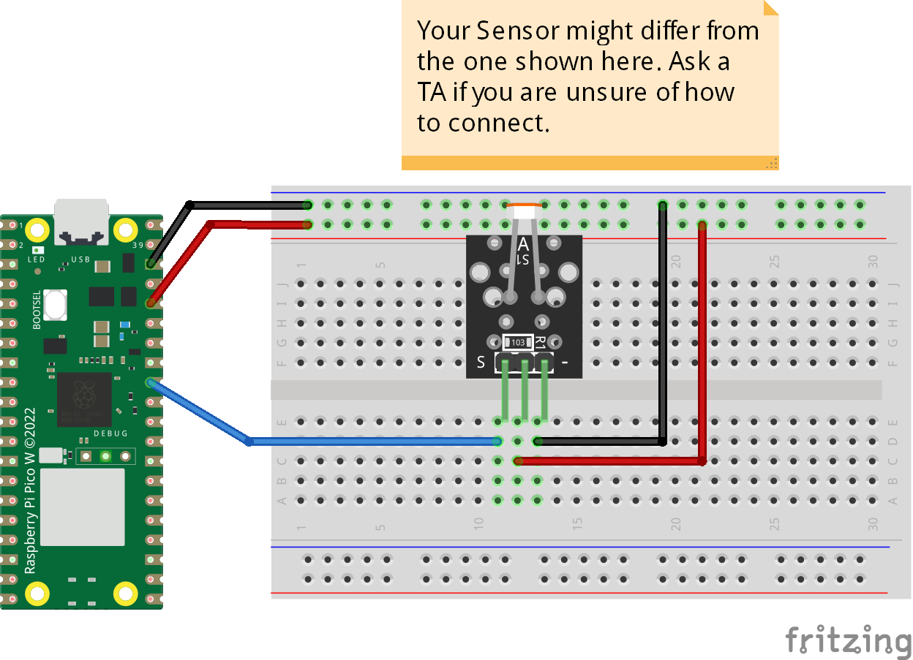
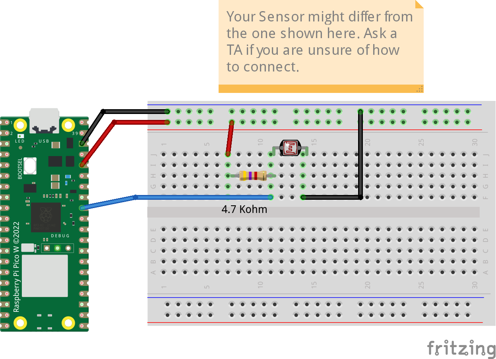

# LDR (Light Dependent Resistor) - Photo Resistor
The code checks if the photoresistor returns more than 70 percent darkness, it turns the onboard LED on and prints to the serial port. If your photoresistor comes on a PCB you connect it to the signal port directly if not then you need to use a 4.7K ohm pull-up resistor. The following diagrams show different connections.

